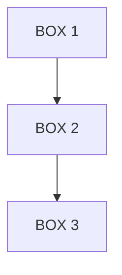

# obsidian-quick-capture - Troubleshooting

## ❌ Problema 1: Classificação Errada

### Sintoma
```
Input: "criar um sistema de vendas"
Esperado: Projeto
Recebido: Tarefa
```

### Causa
Verbo "criar" tem peso alto para tarefas, mas contexto indica projeto.

### Solução

**Melhorar prompt:**
```
❌ "criar um sistema de vendas"
✅ "desenvolver sistema completo de vendas com múltiplos módulos"
```

**Forçar tipo:**
```
"PROJETO: criar um sistema de vendas"
```

**Ajustar manualmente:**
```
Após captura:
1. Abrir nota no Obsidian
2. Mudar "Tipo:" no header
3. Mover para pasta correta
```

---

## ❌ Problema 2: Path do Vault Incorreto

### Sintoma
```
Error: File not found or permission denied
Path: /Users/.../iCloud~md~obsidian/Documents/Claude-code-ios/📋 TAREFAS/tarefa.md
```

### Causa
Vault path configurado incorretamente ou permissões do iCloud.

### Solução

**1. Verificar vault path:**
```bash
# Path padrão (macOS)
ls -la "/Users/felipemdepaula/Library/Mobile Documents/iCloud~md~obsidian/Documents/Claude-code-ios"

# Deve listar pastas do vault
```

**2. Verificar sincronização iCloud:**
```
System Settings → Apple ID → iCloud → iCloud Drive
✅ Obsidian deve estar habilitado
✅ Verificar se arquivos estão sincronizados (não apenas na nuvem)
```

**3. Testar acesso direto:**
```python
# No Claude Code
Read(file_path="/Users/felipemdepaula/Library/Mobile Documents/iCloud~md~obsidian/Documents/Claude-code-ios/📋 TAREFAS")
```

**4. Alternativa: vault local**
```
Se iCloud causar problemas, mover vault para path local:
~/Documents/ObsidianVault/
```

---

## ❌ Problema 3: Transcrição de Voz com Erros

### Sintoma
```
Transcrição: "ei acabei de ter uma idéia maluca"
(erros de pontuação, acentuação)
```

### Causa
Modelo Whisper não adiciona pontuação perfeita.

### Solução

**1. Usar modelo maior:**
```bash
# Small (padrão)
python3 scripts/audio-transcription/transcribe_video.py \
    --model small \
    --input audio.mp3

# Medium (melhor pontuação)
python3 scripts/audio-transcription/transcribe_video.py \
    --model medium \
    --input audio.mp3

# Large (melhor qualidade, mais lento)
python3 scripts/audio-transcription/transcribe_video.py \
    --model large \
    --input audio.mp3
```

**2. Pós-processamento:**
```python
# Adiciona pontuação automática
import re

def fix_transcription(text):
    # Capitalizar início de frases
    text = '. '.join(s.capitalize() for s in text.split('. '))

    # Adicionar vírgulas antes de conectivos
    text = re.sub(r'\s+(e|mas|porque|então)\s+', r', \1 ', text)

    return text

transcription = fix_transcription(raw_transcription)
```

**3. Falar mais claro:**
```
Dicas para melhor transcrição:
✅ Pausas claras entre frases
✅ Falar devagar
✅ Ambiente silencioso
✅ Microfone próximo
❌ Evitar gírias/siglas
```

---

## ❌ Problema 4: Diagramas ASCII Quebrados

### Sintoma
```markdown
# Nota

┌─────────────┐
│   BOX   │
â"

(caracteres Unicode corrompidos)
```

### Causa
Encoding incorreto ao salvar arquivo.

### Solução

**1. Forçar UTF-8:**
```python
# No ObsidianClient
def create_note(self, path, content):
    self.client.create_note(
        path=path,
        content=content,
        encoding='utf-8'  # ✅ Explícito
    )
```

**2. Verificar editor:**
```
Obsidian → Settings → Files & Links
Default character encoding: UTF-8 ✅
```

**3. Template alternativo (ASCII puro):**
```markdown
# Sem Unicode fancy
+-------------+
|   BOX       |
+-------------+
     |
     v
+-------------+
|   BOX 2     |
+-------------+

# Ou minimalista
BOX 1
  |
  v
BOX 2
```

---

## ❌ Problema 5: Pastas Não Criadas Automaticamente

### Sintoma
```
Error: Path not found: 📋 TAREFAS/tarefa.md
```

### Causa
Estrutura de pastas não existe no vault.

### Solução

**1. Criar estrutura manualmente:**
```bash
# No vault do Obsidian
cd "/Users/felipemdepaula/Library/Mobile Documents/iCloud~md~obsidian/Documents/Claude-code-ios"

mkdir -p "📥 INBOX"
mkdir -p "📋 TAREFAS"
mkdir -p "💡 IDEIAS"
mkdir -p "📂 PROJETOS"
mkdir -p "📝 NOTAS"
```

**2. Criar pastas via Bash tool:**
```bash
mkdir -p "/Users/felipemdepaula/Library/Mobile Documents/iCloud~md~obsidian/Documents/Claude-code-ios/📋 TAREFAS/urgente"
mkdir -p "/Users/felipemdepaula/Library/Mobile Documents/iCloud~md~obsidian/Documents/Claude-code-ios/📋 TAREFAS/hoje"
mkdir -p "/Users/felipemdepaula/Library/Mobile Documents/iCloud~md~obsidian/Documents/Claude-code-ios/💡 IDEIAS/validadas"
mkdir -p "/Users/felipemdepaula/Library/Mobile Documents/iCloud~md~obsidian/Documents/Claude-code-ios/📂 PROJETOS/em-andamento"
mkdir -p "/Users/felipemdepaula/Library/Mobile Documents/iCloud~md~obsidian/Documents/Claude-code-ios/📝 NOTAS/tecnico"
```

**3. Obsidian criará automaticamente:**
```
Ao criar arquivo em pasta inexistente via Write(),
o filesystem cria a estrutura automaticamente.
```

---

## ❌ Problema 6: Notas Duplicadas

### Sintoma
```
Múltiplas capturas da mesma ideia:
- 20251105_103045.md
- 20251105_103046.md
- 20251105_103047.md
```

### Causa
Timestamps próximos (< 1s) ou múltiplas execuções.

### Solução

**1. Verificar existentes antes de criar:**
```python
import os
import hashlib

def capture(self, raw_input):
    # Gerar hash do conteúdo
    content_hash = hashlib.md5(raw_input.encode()).hexdigest()[:8]

    # Verificar se arquivo já existe
    filename = f"{content_hash}.md"
    full_path = f"{VAULT_PATH}/📋 TAREFAS/{filename}"

    try:
        existing = Read(file_path=full_path)
        print(f"⚠️ Nota similar já existe: {filename}")
        return filename
    except:
        # Criar nova
        return self._create_new_note(raw_input)
```

**2. Usar IDs únicos:**
```python
import uuid

filename = f"{uuid.uuid4().hex[:8]}.md"
# Exemplo: 7a3f9b2c.md
```

**3. Usar timestamps mais precisos:**
```python
from datetime import datetime

timestamp = datetime.now().strftime('%Y%m%d_%H%M%S_%f')  # Inclui microsegundos
filename = f"{timestamp}.md"
```

---

## ⚠️ Problema 7: Visual ASCII Não Renderiza no Obsidian

### Sintoma
Diagramas aparecem com fonte proporcional (quebrados).

### Causa
Obsidian não usa monospace em blocos de código inline.

### Solução

**1. Usar code blocks:**
````markdown
# ❌ Não funciona
┌─────────────┐
│   BOX       │
└─────────────┘

# ✅ Funciona
```
┌─────────────┐
│   BOX       │
└─────────────┘
```
````

**2. Configurar CSS snippet:**
```css
/* .obsidian/snippets/ascii-diagrams.css */
.markdown-preview-view pre {
    font-family: 'Courier New', monospace;
    font-size: 14px;
    line-height: 1.2;
}

/* Habilitar em Settings → Appearance → CSS snippets */
```

**3. Usar plugin Mermaid:**
```markdown
# Alternativa moderna

````

---

## 🔍 Problema 8: Busca Não Encontra Notas Capturadas

### Sintoma
Nota criada, mas busca do Obsidian não retorna.

### Causa
Indexação não atualizada ou arquivo fora do vault.

### Solução

**1. Verificar path absoluto:**
```python
# ❌ Errado
path = "TAREFAS/tarefa.md"

# ✅ Correto (relativo ao vault)
path = "📋 TAREFAS/tarefa.md"
```

**2. Forçar reindex:**
```
Obsidian → Ctrl+P → "Rebuild Search Index"
```

**3. Verificar .obsidian/config:**
```json
{
  "alwaysUpdateLinks": true,
  "attachmentFolderPath": "./",
  "livePreview": true,
  "useMarkdownLinks": true
}
```

---

## 📊 Logs de Diagnóstico

**Ativar logs detalhados:**

```python
import logging

logging.basicConfig(
    level=logging.DEBUG,
    format='%(asctime)s - %(name)s - %(levelname)s - %(message)s',
    handlers=[
        logging.FileHandler('quick_capture.log'),
        logging.StreamHandler()
    ]
)

logger = logging.getLogger('obsidian-quick-capture')
```

**Ver logs:**
```bash
tail -f quick_capture.log

# Filtrar erros
grep ERROR quick_capture.log
```

---

## 🆘 Suporte

**Não resolveu?**

1. Verificar path do vault está correto
2. Testar Read/Write tools diretamente
3. Verificar sincronização iCloud
4. Verificar permissões de arquivo/pasta

**Debug interativo:**
```bash
# 1. Verificar vault existe
ls -la "/Users/felipemdepaula/Library/Mobile Documents/iCloud~md~obsidian/Documents/Claude-code-ios"

# 2. Testar escrita
echo "# Teste" > "/Users/felipemdepaula/Library/Mobile Documents/iCloud~md~obsidian/Documents/Claude-code-ios/teste.md"

# 3. Verificar criado
cat "/Users/felipemdepaula/Library/Mobile Documents/iCloud~md~obsidian/Documents/Claude-code-ios/teste.md"
```

**Usando Claude Code:**
```python
# Testar Read
Read(file_path="/Users/felipemdepaula/Library/Mobile Documents/iCloud~md~obsidian/Documents/Claude-code-ios/📋 TAREFAS")

# Testar Write
Write(
    file_path="/Users/felipemdepaula/Library/Mobile Documents/iCloud~md~obsidian/Documents/Claude-code-ios/teste.md",
    content="# Teste\n\nConexão OK ✅"
)
```
